# DOM Manipulation

# Task 1
    - Fetch all the product name and store in an array

## code
    let products = []
    let index = 0
    const getProducts = document.querySelectorAll('.as-imagegrid-item')

    for(index; index < getProducts.length; index++) {    
        products.push(getProducts[index].innerText.replace('\nSupport',''))
    }

## output
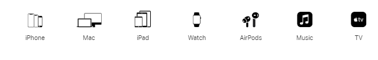

# Task 2
    - Get Element By Id, Create Element, Create Text Node, Append Child

## code 
    let accordion = document.querySelector('.accordion-homepage')
    let section = document.createElement('section')
    section.className = 'parent'
    let heading = document.createElement('h3')
    heading.innerText = 'My New FAQ'
    section.appendChild = heading
    accordion.appendChild = section

## output
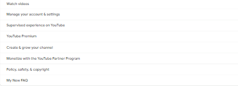

# Task 3
    - Change the contact number

## code 
    let serviceNum = document.querySelector('.service-number')
    serviceNum.innerText = '7584839948'

## output
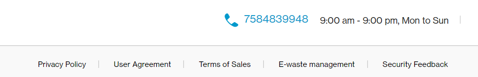

# Task 4
    - Target the main div of card and change the Button text to Check out

## code 
    const button = document.querySelector('.diwali-deals-product-sale-btn')
    button.innerText = 'Check out'

## output
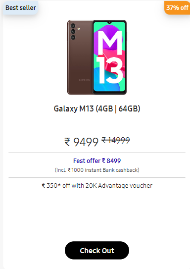

# Task 5
    - Target the search box and on hover change the background color to red

## code 
    let searchInput = document.querySelector('.searchinput___19uW0')
    searchInput.addEventListener('mouseover', function() {
        searchInput.style.backgroundColor = 'red'
    }) 

## output

# Task 6
    - To Search a topic in the MDN Search bar.
    - First add a text to search in the search bar and then hit the submit search button to search the docs using DOM

## code 
    let searchBox = document.querySelector('#hp-search-input')
    searchBox.value = 'CSS Selector'

## output
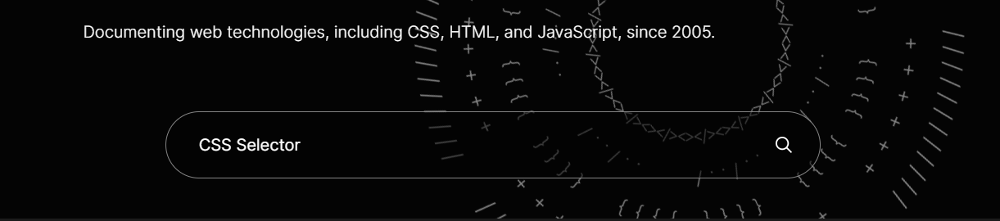

# Task 7
    - Remove alternate languages from the home page languages listed

## code 
    let languages = document.querySelectorAll('#SIvCob a')  
    languages[1].remove()
    languages[2].remove()
    languages[4].remove()
    languages[5].remove()

## output
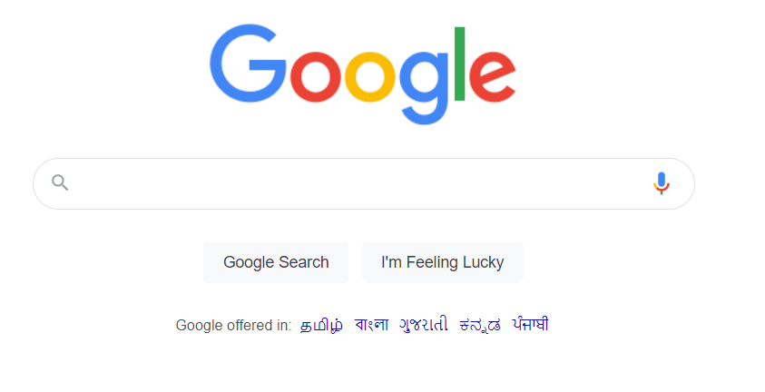

# Task 8
    - Change the font family of the text to monospace and text color to the logo’s background color

## code
    let displayHeading = document.querySelectorAll('.display-heading-1')
    displayHeading[0].style.color = 'red'
    displayHeading[0].style.fontFamily = 'monospace'

## output
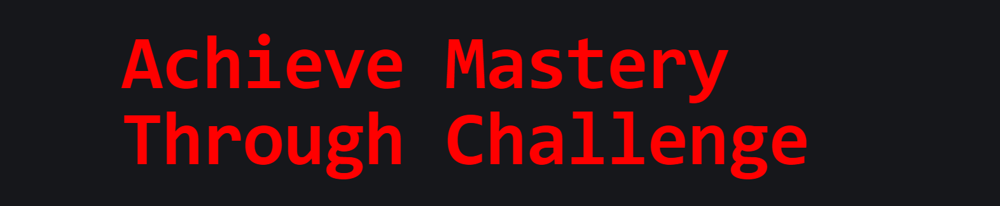

# Task 9
    - Target the button and change background colour on mouseover

## code 
    let button = document.querySelectorAll('.login-btn-text')
    button[1].addEventListener('mouseover', () => { 
        button[1].style.backgroundColor = 'red' 
    })

## output
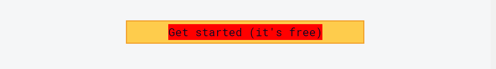

# Task 10
    - change the realme logo to ineuron logo

## code 
    let gutter = document.querySelector(".gutter-xl .col-xl-4 .btn-sm")
    gutter.style.backgroundColor = 'blue'

## output
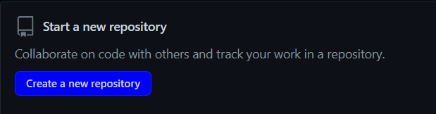

# Task 11
    - Target the top description and change “Matching developers with great companies” to ‘JSBOOTCAMP“

## code 
    let headingText = document.querySelectorAll('.fl-heading-text')
    headingText[0].innerText = 'JSBOOTCAMP'

## output
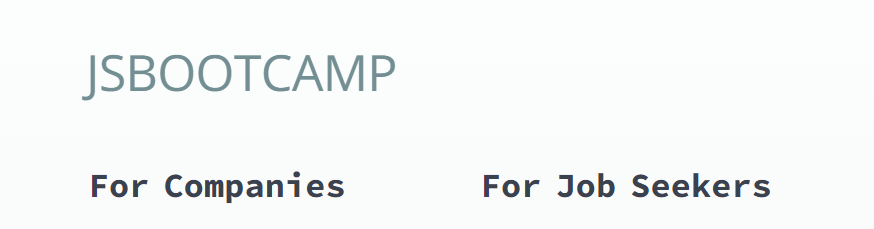

# Task 12
    - change the fontsize of “Hot Deals” to 80px

## code 
    let hotDealHeading = document.querySelector('.HotDealsAll__Heading__2fIbe')
    hotDealHeading.style.fontSize = '80px'

## output
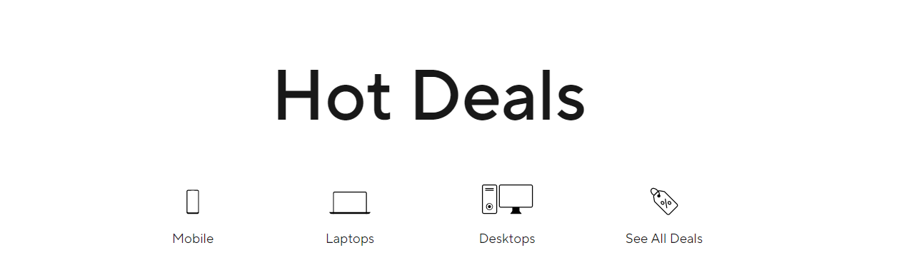

# Task 13
    - Convert the text “G15 Gaming Laptop” from left to right

## code 
    let psTitle = document.querySelectorAll('.ps-top .ps-title')
    psTitle.forEach((arr,index) => {
        psTitle[index].style.fontAlign = 'end'
    })

## output
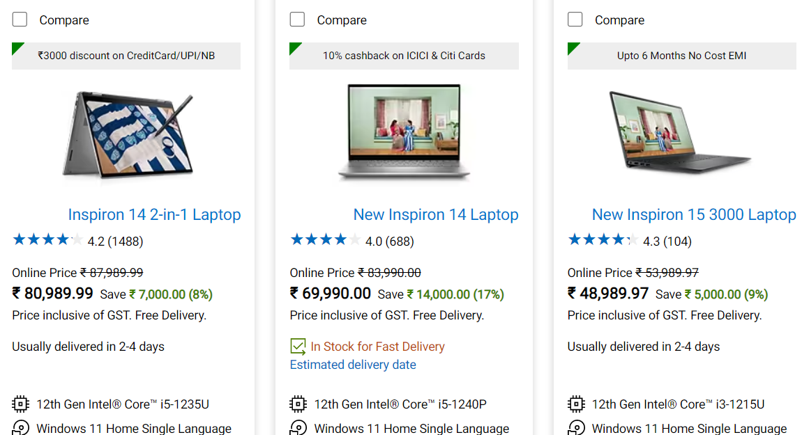

# Task 14
    - change the heading “Start with the developer” to “Start with Scratch”

## code 
    let developerHeading = document.querySelector('.section-title_title__VEDfK')
    developerHeading.innerHTML = 'Start with Scratch'

## output
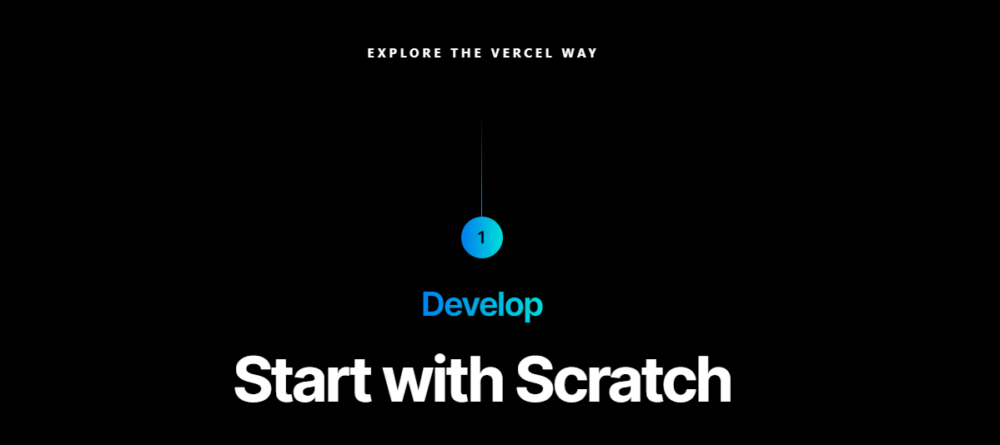

# Task 15
    - change the button text To current Date

## code 
    let btn = document.querySelector('.btn-container')
    let date = new Date()
    btn.innerHTML = date

## output
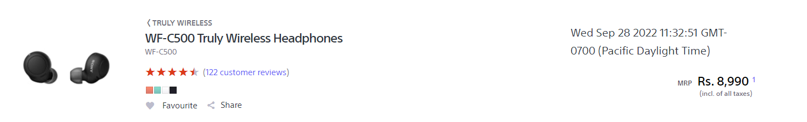

# Task 16
    - change the background colour blue to orange

## code 
    let footer = document.querySelector('.p-f03-footer-container .p-footer')
    footer.style.backgroundColor = 'orange'

## output
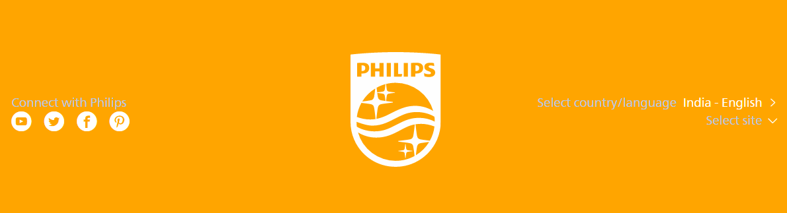

# Task 17
    - extract the canon logo

## code
    let logo = document.querySelector('.logo')
    logo.setAttribute('src')

## output
    '/assets/brand/logo-300-002e45a4aec98fd92899838da9d5560f.png'

# Task 18
    - Change the description colour black to orange

## code 
    let desc = document.querySelectorAll('.desc')
    desc.forEach((arr,index) => { 
        desc[index].style.color = 'orange' 
    })

## output

# Task 19
    - change the realme logo to ineuron logo

## code 
    let logo = document.querySelector('.icon-logo')
    logo.style.backgroundImage = "url('https://ineuron.ai/images/ineuron-logo.png')"

## output
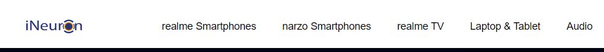

# Task 20
    - Target the Top description div and change the DEV Community to <Your_Name> and description to your passion

## code 
    let heading = document.querySelector(".side-bar .crayons-card .crayons-subtitle-2"
    )
    heading.innerHTML = "iNeuron"

    let paragraph = document.querySelector(".side-bar .color-base-70")
    paragraph.innerHTML = "I Write Code"

## output
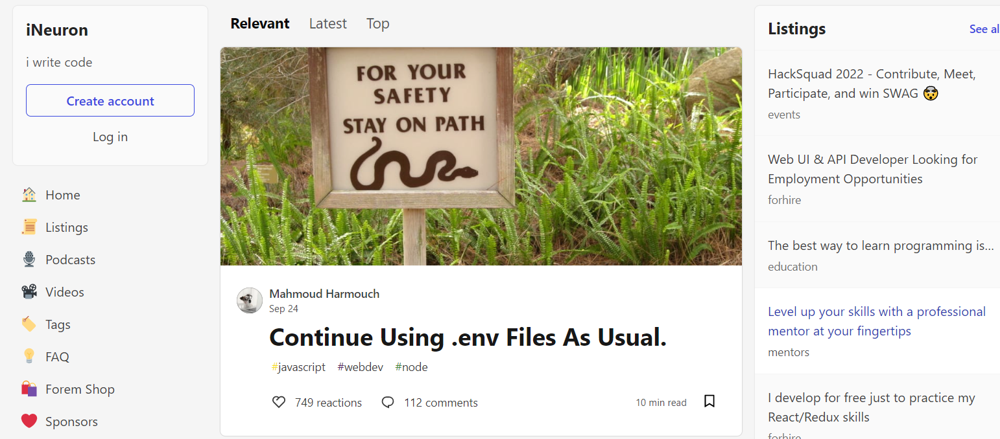